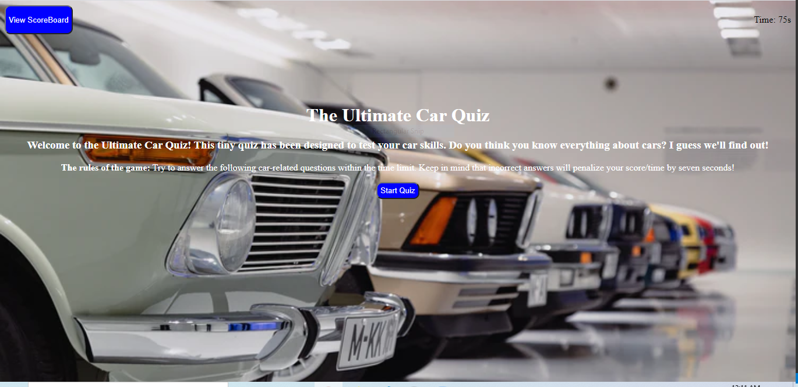
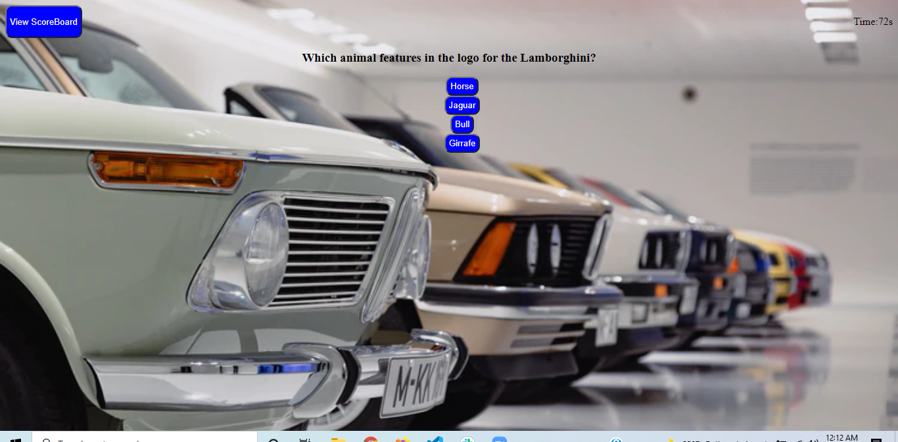

# The Ultimate Car Quiz!

## Description

This is a timed quiz; the length of which is 75 seconds. It features multiple choice questions about car's and gives the user a score afterwords. If the users anwsers incorrectly 7 seconds is deducted from their total time. The users score is the remaining time they have left after finishing the quiz. The user can then choose to save said score and add it to the local leaderbaord. One can also clear all local scores.

### Link

https://jukphillips.github.io/Car-quiz/

## User Story

```
AS A coding boot camp student
I WANT to take a timed quiz on JavaScript fundamentals that stores high scores
SO THAT I can gauge my progress compared to my peers
```

## Acceptance Criteria

```
GIVEN I am taking a code quiz
WHEN I click the start button
THEN a timer starts and I am presented with a question
WHEN I answer a question
THEN I am presented with another question
WHEN I answer a question incorrectly
THEN time is subtracted from the clock
WHEN all questions are answered or the timer reaches 0
THEN the game is over
WHEN the game is over
THEN I can save my initials and my score
```

## ScreenShots

### Start Quiz



### Quiz



### End Quiz


### LeaderBoard


